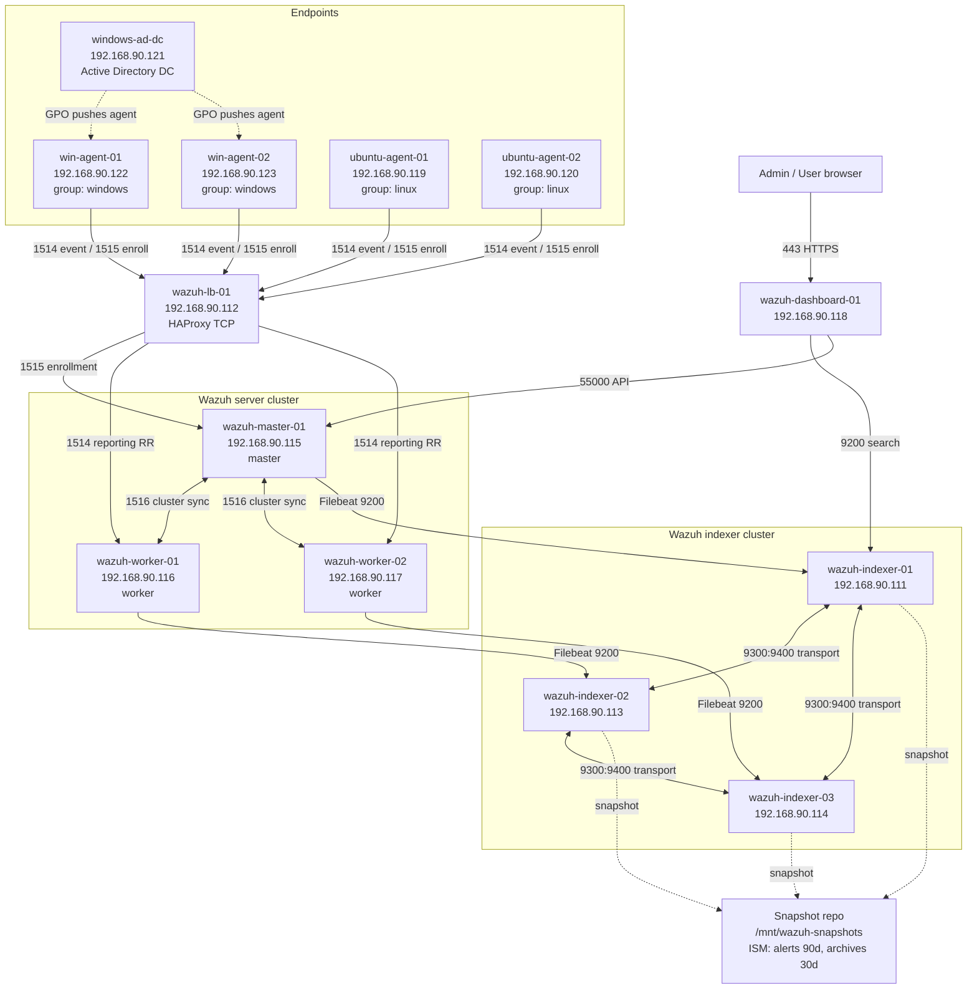
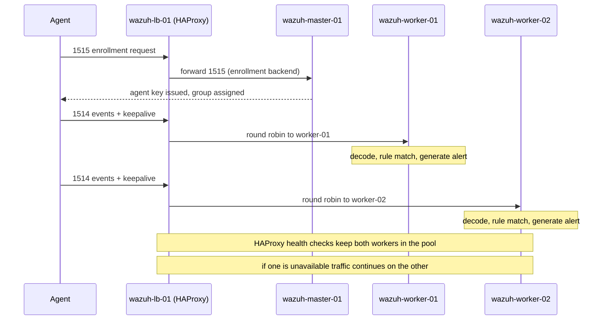
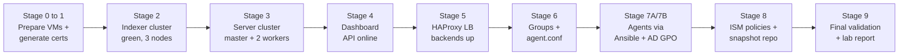

# Production Ready SIEM Deployment

> Wazuh multi node cluster lab (distributed architecture)

Wazuh 4.14.5 stable version distributed deployment on Ubuntu 22.04. All components verified working.

> Install the stable version pinned as `4.14.5-1` on every node (manager, indexer, dashboard,
> agents) so the whole stack runs one consistent version. Verify with
> `apt-cache policy <package>` before installing.

## Topology

### Core SIEM infrastructure

| VM                      | IP             | FQDN                              | Role                  | Status   |
|-------------------------|----------------|-----------------------------------|-----------------------|----------|
| wazuh-indexer-01        | 192.168.90.111 | wazuh-indexer-01.lab.local        | Indexer node          | deployed |
| wazuh-indexer-02        | 192.168.90.113 | wazuh-indexer-02.lab.local        | Indexer node          | deployed |
| wazuh-indexer-03        | 192.168.90.114 | wazuh-indexer-03.lab.local        | Indexer node          | deployed |
| wazuh-manager-master    | 192.168.90.115 | wazuh-manager-master.lab.local    | Server cluster master | deployed |
| wazuh-manager-worker-01 | 192.168.90.116 | wazuh-manager-worker-01.lab.local | Server cluster worker | deployed |
| wazuh-manager-worker-02 | 192.168.90.117 | wazuh-manager-worker-02.lab.local | Server cluster worker | deployed |
| wazuh-dashboard         | 192.168.90.118 | wazuh-dashboard.lab.local         | Dashboard             | deployed |
| wazuh-lb-01             | 192.168.90.112 | wazuh-lb.lab.local                | HAProxy load balancer | deployed |

### Monitored endpoints

| VM             | IP             | Domain / Group      | Role                          | Status   |
|----------------|----------------|---------------------|-------------------------------|----------|
| windows-ad-dc  | 192.168.90.121 | lab.local           | Active Directory DC + DNS     | deployed |
| win-agent-01   | 192.168.90.122 | lab.local / windows | Windows agent (domain member) | deployed |
| win-agent-02   | 192.168.90.123 | lab.local / windows | Windows agent (domain member) | deployed |
| linux-agent-01 | 192.168.90.119 | linux               | Ubuntu agent                  | deployed |
| linux-agent-02 | 192.168.90.120 | linux               | Ubuntu agent                  | deployed |

> Network: everything lives on subnet 192.168.90.0/24. The Windows endpoints join an
> Active Directory domain (lab.local) so the Wazuh agent can be pushed to all of them
> at once through a Group Policy startup script, the same way it would be done across
> a real fleet. The Ubuntu endpoints are handled with Ansible from the master.

## Actual hardware spec (all server nodes)

All 8 server side nodes: Ubuntu 22.04, 2 GB RAM, 128 GB disk.
JVM heap on indexer nodes: 1 GB (Xms1g / Xmx1g).
Swap: 4 GB swapfile on all nodes, vm.swappiness=10.

## Resource requirements at a glance

The lab is 13 VMs total: 8 server side nodes plus 5 monitored endpoints (1 AD domain
controller, 2 Windows agents, 2 Ubuntu agents). Pick one profile from the planning
doc (docs/01-planning.md):

| Profile                     | Total RAM (server + endpoints) | Per indexer       | Use when                         |
|-----------------------------|--------------------------------|-------------------|----------------------------------|
| Actual deployed (this lab)  | ~16 GB server side, tight      | 2 GB / 1 GB heap  | Constrained host, low volume PoC |
| Profile A (minimum lab)     | ~48 to 64 GB comfortable       | 4 GB / 2 GB heap  | Laptop or single workstation     |
| Profile B (production like) | 120 GB+                        | 16 GB / 8 GB heap | Throughput and shard testing     |

Hard requirements regardless of profile: all nodes on subnet 192.168.90.0/24, FQDN
resolution between every node (DNS or /etc/hosts), NTP in sync, 4 GB swap on the
server nodes, `vm.max_map_count=262144` on the indexer nodes, and SSD on the indexers
for any non trivial volume. Full sizing tables in docs/01-planning.md.

## Deployment status

- [x] Stage 0: OS baseline (hostname, /etc/hosts, NTP, swap, kernel tuning, firewall)
- [x] Stage 1: Wazuh certificates generated and distributed
- [x] Stage 2: Indexer cluster deployed and initialized (green, 3 nodes)
- [x] Stage 3: Server cluster deployed (master + 2 workers, Filebeat OK)
- [x] Stage 4: Dashboard deployed and accessible
- [x] Stage 5: HAProxy load balancer (failover verified)
- [x] Stage 6: Agent groups (windows, linux) and centralized config
- [x] Stage 7A: Ubuntu agents deployed via Ansible (2 active, group linux)
- [x] Stage 7B: Windows agents deployed via Active Directory GPO (2 active, group windows)
- [x] Stage 8: Index management (ISM policies applied, snapshot repository configured)
- [x] Stage 9: Final validation (all layers verified, end-to-end ingestion confirmed)

## Time estimate

Approximate hands on time for a clean run by someone following this documentation,
assuming the VMs are already provisioned. Times scale with hardware and familiarity.

| Phase                                    | Stages     | Rough time               |
|------------------------------------------|------------|--------------------------|
| Preparation and certificates             | 0 to 1     | 45 to 90 min             |
| Indexer cluster                          | 2          | 30 to 45 min             |
| Server cluster and dashboard             | 3 to 4     | 45 to 60 min             |
| Load balancer and agent groups           | 5 to 6     | 30 min                   |
| Agent mass deployment (Ansible + AD GPO) | 7A to 7B   | 60 to 90 min             |
| Index management and final validation    | 8 to 9     | 30 to 45 min             |
| **Total**                                | **0 to 9** | **roughly 4 to 6 hours** |

The biggest variables are the Active Directory setup in Stage 7B (forest promotion and
GPO replication add waiting time) and first dashboard load on 2 GB nodes (3 to 5
minutes). Provisioning the 13 VMs and the OS install is not included.

## Verified working

- Indexer cluster: green, 3 nodes, 0 unassigned shards, active_shards_percent 100.0
- Server cluster: master + 2 workers via cluster_control
- Filebeat: all 3 server nodes connected to all 3 indexers over TLSv1.3
- Dashboard: accessible, API Online, no errors on Server APIs page
- Load balancer: HAProxy, all backends UP, failover verified
- Agent groups: windows and linux created, centralized agent.conf verified OK
- Ubuntu agents: 2 enrolled and active, group linux, reporting through load balancer
- Windows agents: 2 enrolled and active via AD GPO, group windows, joined lab.local
- All 4 agents active: 001 agent-linux-01, 002 agent-linux-02, 003 win-agent-02, 004 win-agent-01
- Wazuh API: authenticate returns token (200), dashboard pulls cluster and per node stats OK
- ISM policies: wazuh-alerts-policy (90d) and wazuh-archives-policy (30d) applied
- Snapshot repository: wazuh-snapshots configured, snapshot-test-02 SUCCESS
- End-to-end ingestion: failed SSH logins on agent-linux-01 produced rule 5710 alerts
  searchable in OpenSearch within seconds
- Cluster key (identical on master and both workers): 65eee392122e08d63ee68141da37398b
- Enrollment password: enabled on master (authd.pass), value WazuhEnroll2024!

## Credentials and placeholders

Config files and commands use placeholders for passwords rather than hardcoded
defaults. Replace each with your own value before deploying:

| Placeholder                | What it is                           | Where to set the real value                                            |
|----------------------------|--------------------------------------|------------------------------------------------------------------------|
| `<INDEXER_ADMIN_PASSWORD>` | indexer `admin` user password        | set during indexer install; used in filebeat.yml and all curl examples |
| `<KIBANASERVER_PASSWORD>`  | dashboard service account password   | used in opensearch_dashboards.yml                                      |
| `<WAZUH_WUI_PASSWORD>`     | Wazuh API dashboard account password | used in wazuh.yml                                                      |

The usernames themselves (`admin`, `kibanaserver`, `wazuh-wui`) are built-in Wazuh
accounts and stay as is; only the passwords change. Change the shipped defaults with
the Wazuh password tool and keep them out of any public repo:

```bash
# On an indexer node, change indexer/dashboard internal user passwords
/usr/share/wazuh-indexer/plugins/opensearch-security/tools/wazuh-passwords-tool.sh \
  --change-all --admin-user admin --admin-password <CURRENT_ADMIN_PASSWORD>
```

The enrollment password and cluster key shown above are lab values; generate fresh
ones (`openssl rand -hex 16` for the cluster key) for any non lab deployment.

## Architecture diagrams

### Component architecture and data flow



### Agent traffic and load distribution path



### Deployment sequence



Each stage is verified healthy before the next begins, so the path runs straight
through from a clean VM set to a fully validated SIEM.

## Project structure

```
wazuh-multinode-lab/
  README.md             This landing page (topology, status, diagrams)
  DEPLOYMENT-LOG.md     Stage by stage record of the deployment
  docs/
    01-planning.md      Overview, sizing, network, checklist, deployment sequence
    02-core-stack.md    Indexer cluster, server cluster, dashboard, load balancer
    03-agents.md        Groups, agent.conf, rules and decoders, Windows GPO, Ansible
    04-operations.md    Index and shard management, validation, hardening
  configs/
    indexer/            opensearch.yml per node, index templates, ISM policies
    server/             cluster blocks, global config, Filebeat, custom rules/decoders
    dashboard/          opensearch_dashboards.yml, wazuh.yml
    agents/             agent.conf per group, Ansible playbook and inventory
    lb/                 HAProxy config
    shared/             /etc/hosts, unattended install config
  scripts/              Copy ready scripts (validation, agent deploy)
```

The four docs map to deployment phases in order: read 01, then deploy following 02,
03, and 04. Config files are grouped by the component they belong to, so each stage
pulls from one subfolder. Section numbering (Stage 0 through Stage 9) is preserved
across the docs so cross references stay intact.

## Author

Dimasqi Ramadhani, Security Engineer

- [Portfolio](https://dimasqiramadhani.com)
- [GitHub](https://github.com/dimasqiramadhani)
- [Linkedin](https://linkedin.com/in/dimasqiramadhani)