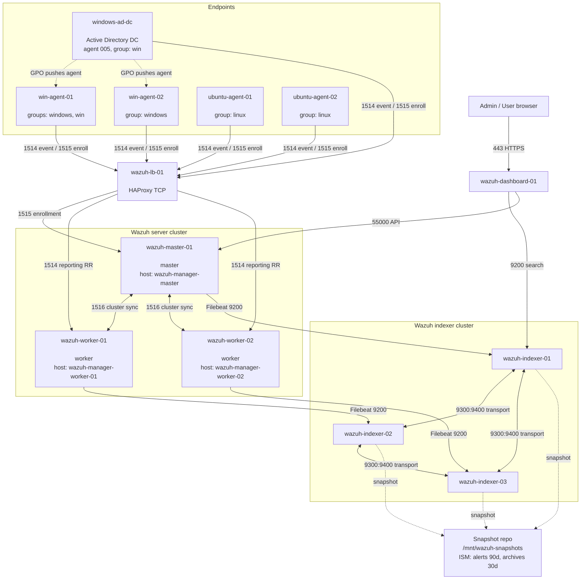
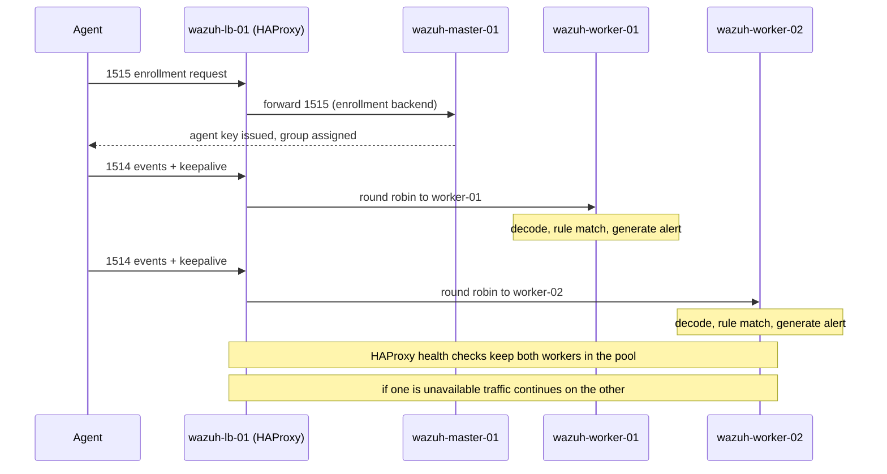
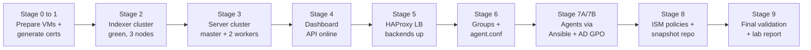

# Production Wazuh SIEM Architecture and Infrastructure Automation

> Wazuh multi node cluster, distributed architecture

Wazuh 4.14.5 stable version distributed deployment on Ubuntu 22.04. All components verified working.

> Install the stable version pinned as `4.14.5-1` on every node (manager, indexer, dashboard,
> agents) so the whole stack runs one consistent version. Verify with
> `apt-cache policy <package>` before installing.

## Topology

### Core SIEM infrastructure

Two naming layers exist on the server nodes and both are real. The operating system
hostname is what the shell prompt and the `manager.name` field in every alert show. The
Wazuh cluster node name is what `cluster_control` reports, what the certificates are
issued to, and what `configs/shared/hosts` resolves. They are not the same string on the
three server nodes, so both are listed here.

| VM (OS hostname)        | IP              | Wazuh node name  | FQDN in hosts file         | Role                  | Status   |
|-------------------------|-----------------|------------------|----------------------------|-----------------------|----------|
| wazuh-indexer-01        | <INDEXER_01_IP> | wazuh-indexer-01 | wazuh-indexer-01.lab.local | Indexer node          | deployed |
| wazuh-indexer-02        | <INDEXER_02_IP> | wazuh-indexer-02 | wazuh-indexer-02.lab.local | Indexer node          | deployed |
| wazuh-indexer-03        | <INDEXER_03_IP> | wazuh-indexer-03 | wazuh-indexer-03.lab.local | Indexer node          | deployed |
| wazuh-manager-master    | <MASTER_IP>     | wazuh-master-01  | wazuh-master-01.lab.local  | Server cluster master | deployed |
| wazuh-manager-worker-01 | <WORKER_01_IP>  | wazuh-worker-01  | wazuh-worker-01.lab.local  | Server cluster worker | deployed |
| wazuh-manager-worker-02 | <WORKER_02_IP>  | wazuh-worker-02  | wazuh-worker-02.lab.local  | Server cluster worker | deployed |
| wazuh-dashboard-01      | <DASHBOARD_IP>  | not applicable   | wazuh-dashboard.lab.local  | Dashboard             | deployed |
| wazuh-lb-01             | <LB_IP>         | not applicable   | wazuh-lb.lab.local         | HAProxy load balancer | deployed |

Three consequences follow from that split, and all three cost time if they are met by
surprise. Alerts are attributed by `manager.name`, so searching for `wazuh-master-01`
in the alert data returns nothing while `wazuh-manager-master` returns everything.
Certificates are issued to the Wazuh node names, so the `hosts` file must resolve those
names regardless of what the machines call themselves. And the dashboard certificate is
issued to `wazuh-dashboard`, which is the FQDN rather than the short hostname
`wazuh-dashboard-01`, so browsing to the short name raises a certificate warning.

See `docs/EVALUATION.md`, findings 1 and 2.

### Monitored endpoints

| VM (OS hostname) | IP                   | Wazuh agent name | ID  | Group(s)     | Role                                |
|------------------|----------------------|------------------|-----|--------------|-------------------------------------|
| ubuntu-agent-01  | <UBUNTU_AGENT_01_IP> | agent-linux-01   | 001 | linux        | Ubuntu agent                        |
| ubuntu-agent-02  | <UBUNTU_AGENT_02_IP> | agent-linux-02   | 002 | linux        | Ubuntu agent                        |
| win-agent-02     | <WIN_AGENT_02_IP>    | win-agent-02     | 003 | windows      | Windows agent, domain member        |
| win-agent-01     | <WIN_AGENT_01_IP>    | win-agent-01     | 004 | windows, win | Windows agent, domain member        |
| windows-ad-dc    | <AD_DC_IP>           | windows-ad-dc    | 005 | win          | Active Directory DC, DNS, and agent |

Five agents are enrolled, not four. The domain controller runs an agent as well, which
is the correct choice for a DC but is easy to overlook when counting endpoints, and it
means the Wazuh fleet includes the machine that pushes the Wazuh installer.

The Ubuntu agents registered under names that differ from their hostnames, and a third
group named `win` exists alongside `windows`. Both are described in
`docs/EVALUATION.md`, findings 3 and 4.

> Network: everything lives on subnet <SUBNET>. The Windows endpoints join an
> Active Directory domain (lab.local) so the Wazuh agent can be pushed to all of them
> at once through a Group Policy startup script, the same way it would be done across
> a real fleet. The Ubuntu endpoints are handled with Ansible from the master.

## Actual hardware spec (all server nodes)

All 8 server side nodes: Ubuntu 22.04, 2 GB RAM, 128 GB disk.
JVM heap on indexer nodes: 1 GB (Xms1g / Xmx1g).
Swap: 4 GB swapfile on all nodes, vm.swappiness=10.

## Resource requirements at a glance

The lab is 13 VMs total: 8 server side nodes plus 5 monitored endpoints (1 AD domain
controller, 2 Windows agents, 2 Ubuntu agents). Pick one profile from the planning
doc (docs/PLANNING.md):

| Profile                     | Total RAM (server + endpoints) | Per indexer       | Use when                         |
|-----------------------------|--------------------------------|-------------------|----------------------------------|
| Actual deployed (this lab)  | ~16 GB server side, tight      | 2 GB / 1 GB heap  | Constrained host, low volume PoC |
| Profile A (minimum lab)     | ~48 to 64 GB comfortable       | 4 GB / 2 GB heap  | Laptop or single workstation     |
| Profile B (production like) | 120 GB+                        | 16 GB / 8 GB heap | Throughput and shard testing     |

Hard requirements regardless of profile: all nodes on subnet <SUBNET>, FQDN
resolution between every node (DNS or /etc/hosts), NTP in sync, 4 GB swap on the
server nodes, `vm.max_map_count=262144` on the indexer nodes, and SSD on the indexers
for any non trivial volume. Full sizing tables in docs/PLANNING.md.

## Deployment status

* [x] Stage 0: OS baseline (hostname, /etc/hosts, NTP, swap, kernel tuning, firewall)
* [x] Stage 1: Wazuh certificates generated and distributed
* [x] Stage 2: Indexer cluster deployed and initialized (green, 3 nodes)
* [x] Stage 3: Server cluster deployed (master + 2 workers, Filebeat OK)
* [x] Stage 4: Dashboard deployed and accessible
* [x] Stage 5: HAProxy load balancer (failover verified)
* [x] Stage 6: Agent groups (windows, linux) and centralized config
* [x] Stage 7A: Ubuntu agents deployed via Ansible (2 active, group linux)
* [x] Stage 7B: Windows agents deployed via Active Directory GPO (2 active, group windows)
* [x] Stage 8: Index management (ISM policies applied, snapshot repository configured)
* [x] Stage 9: Final validation (all layers verified, end to end ingestion confirmed)

## Time estimate

Approximate hands on time for a clean run by someone following this documentation,
assuming the VMs are already provisioned. Times scale with hardware and familiarity.

| Phase                                    | Stages     | Rough time               |
|------------------------------------------|------------|--------------------------|
| Preparation and certificates             | 0 to 1     | 45 to 90 min             |
| Indexer cluster                          | 2          | 30 to 45 min             |
| Server cluster and dashboard             | 3 to 4     | 45 to 60 min             |
| Load balancer and agent groups           | 5 to 6     | 30 min                   |
| Agent mass deployment (Ansible + AD GPO) | 7A to 7B   | 60 to 90 min             |
| Index management and final validation    | 8 to 9     | 30 to 45 min             |
| **Total**                                | **0 to 9** | **roughly 4 to 6 hours** |

The biggest variables are the Active Directory setup in Stage 7B (forest promotion and
GPO replication add waiting time) and first dashboard load on 2 GB nodes (3 to 5
minutes). Provisioning the 13 VMs and the OS install is not included.

## Verified working

* Indexer cluster: green, 3 nodes, 61 primary shards, 107 active, 0 unassigned,
  active_shards_percent 100.0, cluster manager wazuh-indexer-02
* Server cluster: master + 2 workers via cluster_control
* Filebeat: all 3 server nodes connected to all 3 indexers over TLSv1.3
* Dashboard: accessible, API Online, no errors on Server APIs page
* Load balancer: HAProxy, all backends UP, failover verified
* Agent groups: windows and linux created, centralized agent.conf verified OK
* Ubuntu agents: 2 enrolled and active, group linux, reporting through load balancer,
  distributed across both workers rather than landing on one
* Windows agents: 2 enrolled and active via AD GPO, group windows, joined lab.local,
  plus the domain controller itself enrolled as agent 005
* All 5 agents active: 001 agent-linux-01, 002 agent-linux-02, 003 win-agent-02,
  004 win-agent-01, 005 windows-ad-dc. Agent names, groups, and the enrolled domain
  controller are covered in `docs/EVALUATION.md`, findings 3 and 4
* Wazuh API: authenticate returns token (200), dashboard pulls cluster and per node stats OK
* ISM policies: wazuh-alerts-policy (90d) and wazuh-archives-policy (30d) applied
* Snapshot repository: wazuh-snapshots configured, snapshot-test-02 SUCCESS
* End to end ingestion: failed SSH logins on agent-linux-01 produced rule 5710 alerts
  searchable in OpenSearch within seconds
* Cluster key: identical on master and both workers, redacted here as `<CLUSTER_KEY>`
* Enrollment password: enabled on master through `authd.pass`, redacted here as `<ENROLLMENT_PASSWORD>`

## Placeholders

Nothing in this repository carries a value that is specific to the deployment it came
from. Addresses, secrets, and the domain are placeholders, and every one of them has to
be replaced before a command or a config file will work.

### Addresses

Set these once in `configs/shared/hosts` and the FQDNs carry the rest of the way. Every
document uses the placeholder rather than an address.

| Placeholder             | Node                    |
|-------------------------|-------------------------|
| `<INDEXER_01_IP>`       | wazuh-indexer-01        |
| `<INDEXER_02_IP>`       | wazuh-indexer-02        |
| `<INDEXER_03_IP>`       | wazuh-indexer-03        |
| `<MASTER_IP>`           | wazuh-manager-master    |
| `<WORKER_01_IP>`        | wazuh-manager-worker-01 |
| `<WORKER_02_IP>`        | wazuh-manager-worker-02 |
| `<DASHBOARD_IP>`        | wazuh-dashboard-01      |
| `<LB_IP>`               | wazuh-lb-01             |
| `<AD_DC_IP>`            | windows-ad-dc           |
| `<WIN_AGENT_01_IP>`     | win-agent-01            |
| `<WIN_AGENT_02_IP>`     | win-agent-02            |
| `<UBUNTU_AGENT_01_IP>`  | ubuntu-agent-01         |
| `<UBUNTU_AGENT_02_IP>`  | ubuntu-agent-02         |
| `<SUBNET>`              | the flat subnet all thirteen nodes share |

The eight server nodes and the five endpoints sit on one subnet in this build. Nothing in
the design requires that, but the firewall matrix in `docs/PLANNING.md` assumes it, so
splitting them across subnets means revisiting that matrix.

### Secrets

| Placeholder                | What it is                           | Where the real value lives                                          |
|----------------------------|--------------------------------------|---------------------------------------------------------------------|
| `<INDEXER_ADMIN_PASSWORD>` | indexer `admin` user password        | set during indexer install, used in filebeat.yml and every curl call |
| `<KIBANASERVER_PASSWORD>`  | dashboard service account password   | `opensearch_dashboards.yml`                                          |
| `<WAZUH_WUI_PASSWORD>`     | Wazuh API dashboard account password | `wazuh.yml`                                                          |
| `<CLUSTER_KEY>`            | Wazuh server cluster shared key      | the cluster block of `ossec.conf` on all three server nodes          |
| `<ENROLLMENT_PASSWORD>`    | agent enrollment password            | `/var/ossec/etc/authd.pass` on the master, and every agent installer |

The three usernames (`admin`, `kibanaserver`, `wazuh-wui`) are built in Wazuh accounts
and stay as they are. Only the passwords change:

```bash
# On an indexer node, change indexer and dashboard internal user passwords
/usr/share/wazuh-indexer/plugins/opensearch-security/tools/wazuh-passwords-tool.sh \
  --change-all --admin-user admin --admin-password <CURRENT_ADMIN_PASSWORD>
```

The cluster key and the enrollment password deserve particular care, because they are
what an attacker needs to join a rogue node to the cluster or to enroll a rogue agent.
Generate fresh values rather than reusing anything published anywhere:
`openssl rand -hex 16` for the cluster key, and any strong secret for enrollment.

### Domain

The Active Directory domain is `lab.local` with NetBIOS name `LAB`, and the node FQDNs
follow it. It is an example domain rather than a real one, so substitute your own
throughout `docs/AGENTS.md` and `configs/shared/hosts` if you are reproducing this.

One caveat about the evidence: the screenshots in `screenshots/` were captured before
this substitution and still show the addresses and the indexer password as they were on
the day. See `docs/EVALUATION.md`, findings 7 and 12.

## Architecture diagrams

### Component architecture and data flow


```mermaid
flowchart TB
    subgraph EP["Endpoints"]
        DC["windows-ad-dc<br/><AD_DC_IP><br/>Active Directory DC<br/>agent 005, group: win"]
        W1["win-agent-01<br/><WIN_AGENT_01_IP><br/>groups: windows, win"]
        W2["win-agent-02<br/><WIN_AGENT_02_IP><br/>group: windows"]
        U1["ubuntu-agent-01<br/><UBUNTU_AGENT_01_IP><br/>group: linux"]
        U2["ubuntu-agent-02<br/><UBUNTU_AGENT_02_IP><br/>group: linux"]
    end

    LB["wazuh-lb-01<br/><LB_IP><br/>HAProxy TCP"]

    subgraph SRV["Wazuh server cluster"]
        M["wazuh-master-01<br/><MASTER_IP><br/>master<br/>host: wazuh-manager-master"]
        K1["wazuh-worker-01<br/><WORKER_01_IP><br/>worker<br/>host: wazuh-manager-worker-01"]
        K2["wazuh-worker-02<br/><WORKER_02_IP><br/>worker<br/>host: wazuh-manager-worker-02"]
    end

    subgraph IDX["Wazuh indexer cluster"]
        I1["wazuh-indexer-01<br/><INDEXER_01_IP>"]
        I2["wazuh-indexer-02<br/><INDEXER_02_IP>"]
        I3["wazuh-indexer-03<br/><INDEXER_03_IP>"]
    end

    SNAP["Snapshot repo<br/>/mnt/wazuh-snapshots<br/>ISM: alerts 90d, archives 30d"]

    D["wazuh-dashboard-01<br/><DASHBOARD_IP>"]
    A["Admin / User browser"]

    DC -.->|GPO pushes agent| W1
    DC -.->|GPO pushes agent| W2
    DC -->|1514 event / 1515 enroll| LB
    W1 -->|1514 event / 1515 enroll| LB
    W2 -->|1514 event / 1515 enroll| LB
    U1 -->|1514 event / 1515 enroll| LB
    U2 -->|1514 event / 1515 enroll| LB

    LB -->|1515 enrollment| M
    LB -->|1514 reporting RR| K1
    LB -->|1514 reporting RR| K2

    M <-->|1516 cluster sync| K1
    M <-->|1516 cluster sync| K2

    M -->|Filebeat 9200| I1
    K1 -->|Filebeat 9200| I2
    K2 -->|Filebeat 9200| I3

    I1 <-->|9300:9400 transport| I2
    I2 <-->|9300:9400 transport| I3
    I1 <-->|9300:9400 transport| I3

    I1 -.->|snapshot| SNAP
    I2 -.->|snapshot| SNAP
    I3 -.->|snapshot| SNAP

    D -->|9200 search| I1
    D -->|55000 API| M
    A -->|443 HTTPS| D
```

### Agent traffic and load distribution path


```mermaid
sequenceDiagram
    participant Agent
    participant LB as wazuh-lb-01 (HAProxy)
    participant Master as wazuh-master-01
    participant W1 as wazuh-worker-01
    participant W2 as wazuh-worker-02

    Agent->>LB: 1515 enrollment request
    LB->>Master: forward 1515 (enrollment backend)
    Master-->>Agent: agent key issued, group assigned

    Agent->>LB: 1514 events + keepalive
    LB->>W1: round robin to worker-01
    Note over W1: decode, rule match, generate alert

    Agent->>LB: 1514 events + keepalive
    LB->>W2: round robin to worker-02
    Note over W2: decode, rule match, generate alert

    Note over LB,W2: HAProxy health checks keep both workers in the pool
    Note over LB,W2: if one is unavailable traffic continues on the other
```

### Deployment sequence


```mermaid
flowchart LR
    P["Stage 0 to 1<br/>Prepare VMs +<br/>generate certs"] --> IX["Stage 2<br/>Indexer cluster<br/>green, 3 nodes"]
    IX --> SC["Stage 3<br/>Server cluster<br/>master + 2 workers"]
    SC --> DB["Stage 4<br/>Dashboard<br/>API online"]
    DB --> LBD["Stage 5<br/>HAProxy LB<br/>backends up"]
    LBD --> G["Stage 6<br/>Groups +<br/>agent.conf"]
    G --> AG["Stage 7A/7B<br/>Agents via<br/>Ansible + AD GPO"]
    AG --> IM["Stage 8<br/>ISM policies +<br/>snapshot repo"]
    IM --> R["Stage 9<br/>Final validation<br/>+ lab report"]
```

Each stage is verified healthy before the next begins, so the path runs straight
through from a clean VM set to a fully validated SIEM.

## Project structure

```
.
├── README.md
├── docs/
│   ├── PLANNING.md           # overview, sizing, network, checklist, sequence
│   ├── CORE_STACK.md         # indexer cluster, server cluster, dashboard, load balancer
│   ├── AGENTS.md             # groups, agent.conf, rules and decoders, GPO, Ansible
│   ├── OPERATIONS.md         # index and shard management, validation, hardening
│   ├── DEPLOYMENT_LOG.md     # stage by stage record of the actual deployment
│   └── EVALUATION.md         # consistency audit of this repository against the configs
├── configs/
│   ├── indexer/              # opensearch.yml per node, index templates, ISM policies
│   ├── server/               # cluster blocks, global config, Filebeat, rules, decoders
│   ├── dashboard/            # opensearch_dashboards.yml, wazuh.yml
│   ├── agents/               # agent.conf per group, Ansible playbook and inventory
│   ├── lb/                   # HAProxy config
│   └── shared/               # /etc/hosts, certificate tool config
├── scripts/                  # copy ready scripts for validation and agent deployment
└── screenshots/
```

Read `docs/PLANNING.md` first, then deploy following `docs/CORE_STACK.md`,
`docs/AGENTS.md`, and `docs/OPERATIONS.md` in that order. `docs/DEPLOYMENT_LOG.md`
records what was actually run and what each stage returned, and `docs/EVALUATION.md`
records where this repository and the deployed configuration disagree.

File names carry no ordering prefix, so the reading order lives here rather than in the
names. The stage numbering inside the documents, Stage 0 through Stage 9, is unchanged,
because cross references between documents depend on it.

Config files are grouped by the component they belong to, so each stage pulls from one
subfolder.

## Screenshots

Captured from the running deployment, in `screenshots/`.

| File                       | What it shows                                           |
|----------------------------|---------------------------------------------------------|
| `Nodes.png`                | indexer cluster node list, three nodes                  |
| `Cluster.png`              | server cluster status, master and two workers           |
| `Health_Check.png`         | dashboard health check against the Wazuh API            |
| `Filebeat_Test_Output.png` | Filebeat output test from a server node to the indexers |
| `Agent_List.png`           | all four agents active with their groups                |
| `Home_Page.png`            | dashboard landing page                                  |
| `Discover_Menu.png`        | alert search in Discover                                |
| `IT_Hygiene.png`           | IT Hygiene module                                       |
| `ISM_and_Snapshot.png`     | ISM policies applied and snapshot repository            |
| `Cover_Image.png`          | cover image used at the top of this page                |

## Author

Dimasqi Ramadhani, Security Engineer

* [Portfolio](https://dimasqiramadhani.com)
* [GitHub](https://github.com/dimasqiramadhani)
* [LinkedIn](https://linkedin.com/in/dimasqiramadhani)